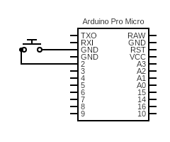

# Tiny Mute Switch project
This tiny project implements a dedicated USB HID button designed for a usefull microphone mute switch. Any kind of switch can be used: a keyboard switch, a foot pedal or even a paperclip and a piece of foil.

## What can it do?
It can toggle the microphone or and off with a short press, but if the button in hold down long enough, it will mute/unmute on release too. It also implements a configurable debounce to ensure dubious quality buttons will work kinda consistently.

Both the time limit for a "short press" and the debounce time can be configured in the project before flashing the device.

## How it works
An USB HID capable microcontroller is the brain of the operation. I've used an Arduino pro micro (any variant using the Atmega32u4 chip will work). There are other micros capable of native HID that will be able to be flashed after installing the apropiate board in arduino IDE, like the esp32 s2, s3 and p4 variants, but bare in mind these are way more power hungry than the pro micro. If you want to use any of those, I strongly suggest writting the program in esp-idf instead.

The project contains 4 global variables you can configure before flashing the device:

```c++
// The debug led pin
#define LED_PIN 17
// the pin to read the button state
#define BUTTON_PIN 2
// How long in ms a press will still be considered short
#define UNPRESS_TIMER_MAX 500
// How long in ms the debunce is
#define DEBOUNCE 10
```

Some clarification with these values:
 - **LED_PIN**: If you want, you can define a pin to just power on and off when the button itself is pressed, no matter the current mute/unpute state. Not necesary in any way, shape or form, but really usefull to debug the button conection. It defaults to pin 17, which is the builtin LED of the arduino pro micro.
 - **BUTTON_PIN**: What pin will be reading the buttons state. The pin we usse here is really important. For efficiency, this program is powered by interrupts, meaning the relevant code only executes if certain conditions are met. The pro micro only support interrupts in certain pins. Specifically number 0, 1, 2, 3 and 7 are interrupt capable, you can use any of them.
 - **UNPRESS_TIMER_MAX**: The point in ms where a short press becomes a long press. Whenever the button is pressed down, the mute key is sent. When the button is released, if the press lasted less than UNPRESS_TIMER_MAX, nothing happens, but if its longer, then the mute event is sent once again. This allows you to both toggle the mute with a short press and hold/release to mute/unmute quickly. It defaults to 500ms.
 - **DEBOUNCE**: How long in ms the debounce is. With better quality buttons you can decrease the debounce time and still get consistent results. With the crappy button I tested 10ms worked decently.

 The button pin is configured as a pullup, so we only need to properly conect the button, one end to the pin and the other to gorund:  


The last issue it the mute operation itself. The microcontroller is an HID device. Particularly, its working as a keyboard. Sadly **there is no dedicated key code for microphone mute/unmute**. If you see such a button in a laptop for example, those work using another kind of signal that not only isn't HID, but propietary and would need to be reimplemented for each laptop (not to menttion that nearly no desktop could support it).  
With this in mind, the microcontroller sends a rarely used key, by default F24, and the computer needs to recognize it. You can configure any key or key combination you want in the send_mute function using the Keyboard.h library:

```c++
void send_mute(){
  Keyboard.press(KEY_F24);
  Keyboard.release(KEY_F24);
}
```

You can implement the key combo for specific apps like discord or teams, or you can configure a macro for the whole system. Autohotkey or even a power shell script could work. In my testing, i've found the easiest way for windows is using [sound switch](https://soundswitch.aaflalo.me/), an opensource and powerfull media control utility.

## How to build
Install arduino IDE, open the project (Mute_switch.ino) and configure the switch parameters as you like.

Then connect the controller and hit the upload button in the top left (The left pointing arrow button). After a few seconds you should see in the terminal that the flash suceced.

Now you can wire the button or just short your selected pin to ground. If you used a key without an effect (like the defualt F24) and/or havent set up the macro yet, you can check the builtin led (or external one if you decided to change it) to ensure the program is working.

**Congratulations on your new mute switch!**
